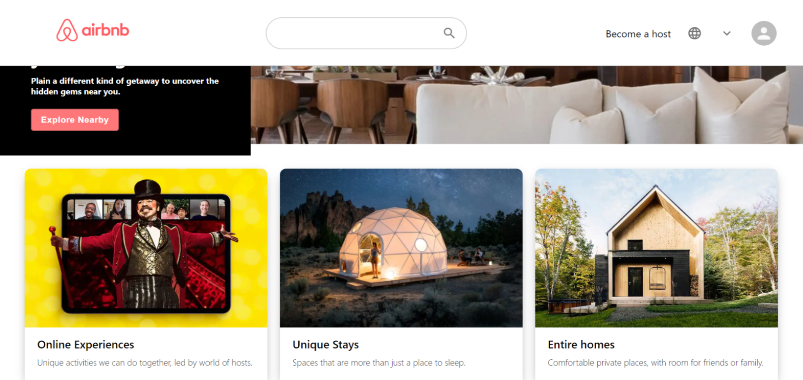

# Online Marketplace Service App - Design of [Airbnb-Clone](https://airbnb-clone-d469f.web.app/)
 This app has no copyrights reserved, I've done it simply because I like the web design and seek to recreate it :)

 

## General Highlights of the Airbnb-Clone App:
    
   |    Highlights                      |                         Description                                                                               |
   |:----------------------------------:| ------------------------------------------------------------------------------------------------------------------|  
   | **Responsive Design:**             | The App is scalable with width and height change                                                                  |
   | **Date Picker:**           | Date and Guest Number Selection are introduced in this build                             |
   | **Neat Room-Search Results**    | Clear and well-organised search result cards      |
   | **Clean Landing Page:** | Informative yet organised Landing Page with Interactive Content Cards                    |
   | **Single-Page-App Build:** | All Component Switch is performed without page refresh with React-Router-Dom [[1]](#fn_1)                             |
     
 

## Languages and Tools:

   |    Syntax   |                         Description                                       |
   | :---------: | :-----------------------------------------------------------------------: |  
   | Framework   | React.js with Hooks/Function Component/     |
   | Languages   | Javascript/CSS in BEM[[2]](#fn_2) /HTML        |
   | Code Editor | Visual Studio Code                                                        |
   | Hosting     | Firebase Hosting Service                                                  |

- *All code for this project could be found in the 'src' folder.*

 

## External Plugins 
 

## Components
 

## My Other Open Source Projects
 

## Footnodes

<b id="fn_1">[1]</b> [React-Router-Dom](https://reactrouter.com/web/guides/quick-start) allows your applications to jump between various components easily with specified domains. [↩](#footnode_1)  
<b id="fn_2">[2]</b> BEM refers to the Block, Element, Modifier methodology which allows code to be scalable and reusable. [↩](#footnode_2)  

